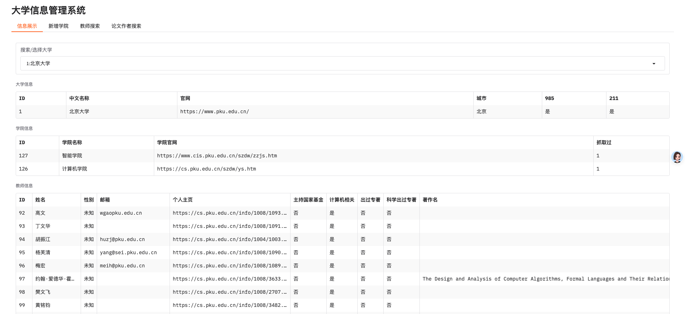

# 项目目标
从 arxiv 获取计算机类论文中国大学的作者
从 985，211，双一流，重点学科，高校的老师

# 环境
```
python3.10 -m venv venv
source venv/bin/activate
pip install -r requirements.txt 

```

# 运行
```
# 查看mysql是否运行
docker ps -a
# 启动mysql
docker start mysqlid

#运行 


# 从 arxiv 获取计算机论文作者
python crawler_arxiv_paper.py

# 从大学获取计算机老师
python crawler_university_teacher.py

# 启动UI
python gradio_university.py

```



# 权限
```
sudo chown -R fxbox:fxbox /data/work
```

# frp
```
cat /data/work/frp/frpc.ini 
vim /data/work/frp/frpc.ini

# gradio_university 6610
[ssh-6610]
type = tcp
local_ip = 127.0.0.1
local_port = 6610
remote_port = 6610
use_encryption = false
use_compression = false

# 重启frp
sudo systemctl restart  supervisor
sudo supervisorctl reload
sudo supervisord
```